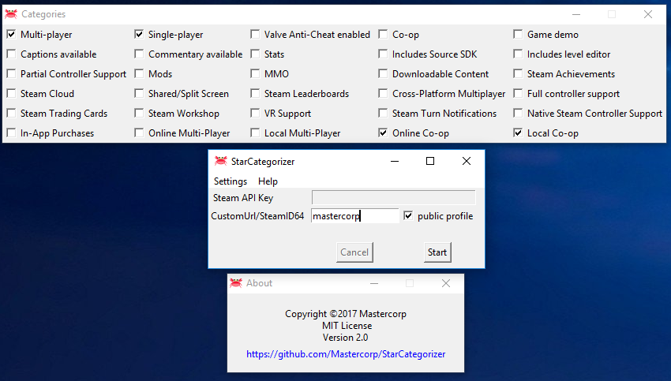

## StarCategorizer 2.1.1

StarCategorizer autocategorizes your games in your Steam library. You do not need to set your profile public! The games' Steam store genre is used as category ( + steam categories which you can choose on your own!). Your old categories are deleted, only your Favorites are saved. A backup is made from your old config file (called sharedconfig.vdf.bak)
You don't need to set your profile status to public for this programm to work ;)
The language of the categories depends on your steam website settings. ( https://store.steampowered.com/api/appdetails/?appids=220 you can check it here. Just click the link and see which language the text is written in. )  
You can join the Steamgroup here: http://steamcommunity.com/groups/StarCategorizer

## What you need

If your profile is public you only need your custom url!( you can find it with https://steamid.io/ , if you dont have a custom url you need your steamID64, which you will find on the website too.)  
For a private profil, you need a Steam API key.  
Steam API key: you can get it here: https://steamcommunity.com/dev/apikey  
(if you do not have a domain, enter your e-mail)  
steam64ID: search with your custom url name at https://steamid.io/  
or read here : https://steamcommunity.com/discussions/forum/1/364039785160857002/  
If you use the python code you need python 2.7

## Motivation

I could not manage to make Depressurizer work on my system, therefore i wrote my own programm. You can find Depressurizer here:  https://github.com/rallion/depressurizer

## Installation

Download the StarCategorizer.exe file and put it in your \Steam\userdata\<Steam User ID>\7\remote\ folder. Start the exe, put in your Steam API key and steamID64 and press the 'Start' button or just use the checkbox if your profilestatus is set to public and enter your custom url. Wait until the programm is finished and start Steam. Enjoy your categories. You need an internet connection for the programm to work! (No python needed! I used pyinstall to pack everything you need into the exe file.) As an alternative, you can copy your sharedconfig.vdf file in the same folder as the StarCategorizer.exe and after the programm is finished you only need to copy the new file back.

If you don´t trust my exe, you can download the categorizer.py and start the programm from there. Don´t forget to download the logo.ico as well, else it wont work ;) (You need to install python to use the StarCategorizer.py)  
You can create your own exe with pyinstaller. To create the exe install pyinstaller and use my Star.spec file. You just have to include the right folder in the spec file at pathex.

## Buttons

Quit closes the app.  
Start starts the process of categorizing your games and makes a backup of your sharedconfig.vdf file. (If a sharedconfig.vdf.bak exists, sharedconfig.vdf.bak does't get overwritten.If you want to make a new backup you have to delete sharedconfig.vdf.bak first)
Cancel stops categorizing your games and restores sharedconfig.vdf(everything in sharedconfig.vdf.bak is coppied back to sharedconfig.vdf)  
public profile: if your Steam profile status is set to public you do not need a steam api key anymore! Just enter your custom url and you are ready!  
Settings : You can choose which categories from steam you want to add to your games. ( Shop genres can not be changed and are assigned automatically )  

## Donate
Bitcoin: 1NE7tpCaHXMG3VP2oQrx1L53MEPnAp39xM  
Litecoin: LLCmNPWBt8TxnNuaTWfyDdajXM5rZPuzsT  
Bytecoin: 23PcpRoPL24U3jnhgH38Za7ZLAhrpXNQUA7NhW2nyJqJ54VCP7M6M1VhP76WAxed7J9XCuzbnjZqz1MQUc6MPJjTUDaZuiS  
Reddcoin: Rsjofwt2TNu6Gf6eQdzyUhJe2J6vLsKoBq  
Dogecoin: DM13fiivexaZf35HTQ7AKBFLxNTHhJXu1c  
Vertcoin: VbKfmr7B352WEPs3Qi7VeC4WviGS1jGQvd  

## License

MIT License

Copyright (c) 2017 Mastercorp

Permission is hereby granted, free of charge, to any person obtaining a copy
of this software and associated documentation files (the "Software"), to deal
in the Software without restriction, including without limitation the rights
to use, copy, modify, merge, publish, distribute, sublicense, and/or sell
copies of the Software, and to permit persons to whom the Software is
furnished to do so, subject to the following conditions:

The above copyright notice and this permission notice shall be included in all
copies or substantial portions of the Software.

THE SOFTWARE IS PROVIDED "AS IS", WITHOUT WARRANTY OF ANY KIND, EXPRESS OR
IMPLIED, INCLUDING BUT NOT LIMITED TO THE WARRANTIES OF MERCHANTABILITY,
FITNESS FOR A PARTICULAR PURPOSE AND NONINFRINGEMENT. IN NO EVENT SHALL THE
AUTHORS OR COPYRIGHT HOLDERS BE LIABLE FOR ANY CLAIM, DAMAGES OR OTHER
LIABILITY, WHETHER IN AN ACTION OF CONTRACT, TORT OR OTHERWISE, ARISING FROM,
OUT OF OR IN CONNECTION WITH THE SOFTWARE OR THE USE OR OTHER DEALINGS IN THE
SOFTWARE.

